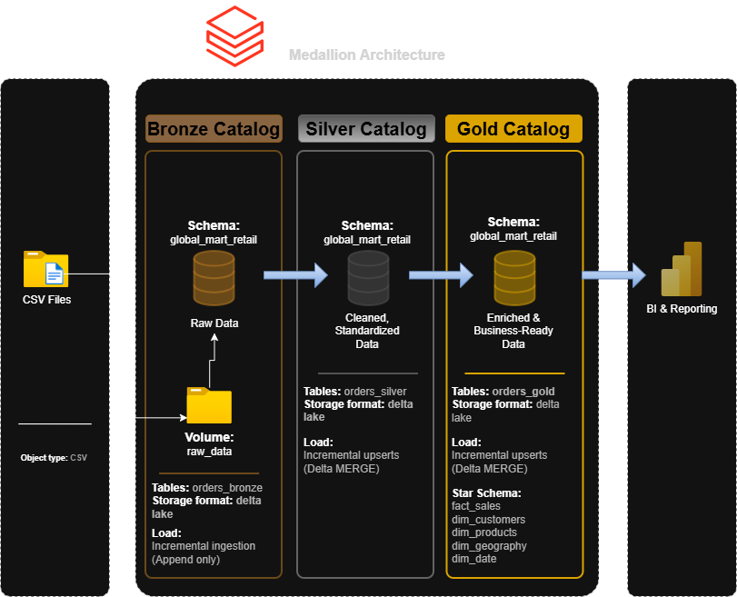
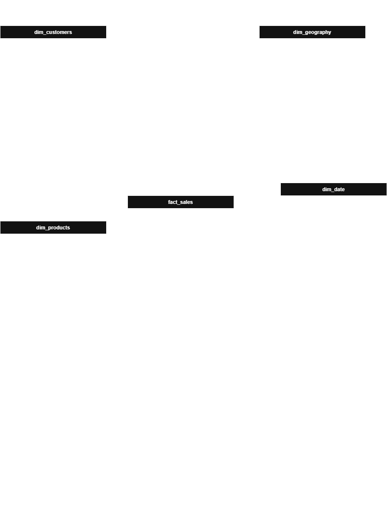

## Global Mart Retail Analytics Platform

An end-to-end **Data Lakehouse analytics project** built on Databricks, following the **Medallion Architecture (Bronze, Silver, Gold)**.  
The project demonstrates real-world data engineering practices including incremental data loading, dimensional modeling, and analytics-ready data design using **Spark, PySpark, SQL, Delta Lake, and Unity Catalog**.

Designed as both a **learning project and a portfolio-grade implementation** aligned with production data engineering patterns.

---

### 🏗️ Medallion Architecture
- Databricks with Unity Catalog for governance
- Medallion Architecture (Bronze / Silver / Gold)
- Kimball-style Star Schema (facts and dimensions)
- Power BI for analytics and reporting

---

### 📈 Data Flow
Raw CSV → Bronze → Silver → Gold → Star Schema → Power BI

---

### 🥉 Bronze Layer
- Raw data ingestion from CSV files
- Minimal transformations
- Schema inference and storage as Delta tables (`orders_bronze`)

---

### 🥈 Silver Layer
- Data cleansing and standardization
- Type casting, validation, and basic data quality rules
- Schema evolution handled using Delta Lake
- Stored as Delta tables (`orders_silver`)

---

### 🥇 Gold Layer
- Enriched, business-ready fact-level order data (`orders_gold`)
- Dimensional modeling for BI and analytics use cases

### 🧠 Data Modeling
- Fact table grain: one row per order line
- Surrogate keys used for all dimensions
- Dimensions implemented as SCD Type 1

**Star Schema (Power BI ready)**
- `dim_customers`
- `dim_products`
- `dim_geography`
- `dim_date`
- `fact_sales`

---

### 🧪 Synthetic Data Generation & Backfill Simulation
To simulate real-world production scenarios, a synthetic data generator is built using the original Superstore dataset as a baseline. This setup enables realistic experimentation with orchestration, scheduling, and historical data reprocessing, as it enables:
- Generation of monthly raw data files beyond the original dataset
- Parameterized backfills using Databricks widgets (start date, end date, data scale)
- Simulation of late-arriving data
- Controlled data volume growth via a rows_multiplier
- Loading data at scale into partitioned raw data volumes (year-based)
- Fully idempotent job runs, safe for reprocessing and retries
---

### 🔄 Orchestration
- Databricks Workflows for end-to-end pipeline execution
- Parameterised jobs using widgets
- Idempotent Delta MERGE operations for incremental and repeatable loads
---

### 📊 Analytics & CI/CD
- Power BI used for analytics and reporting
- Seamless deployment into Microsoft Fabric workspaces, using PBIP-based CI/CD pipeline, enabling automated publishing of:
  - Power BI reports
  - Semantic models
